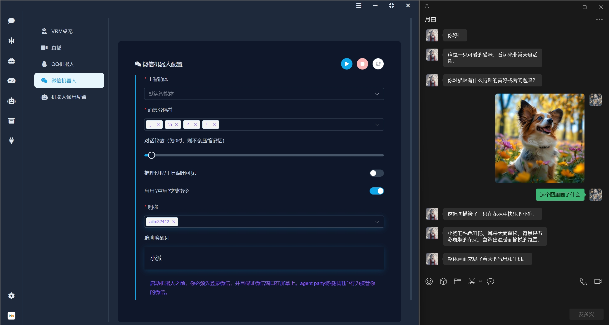

<div align="center">
  <a href="./README_ZH.md">简体中文</a> |
  <a href="./README.md">English</a>
</div>

####

<div align="center">
  <a href="https://space.bilibili.com/26978344">B站</a> ·
  <a href="https://www.youtube.com/@LLM-party">youtube</a> ·
  <a href="https://gcnij7egmcww.feishu.cn/wiki/DPRKwdetCiYBhPkPpXWcugujnRc">中文文档</a> ·
  <a href="https://temporal-lantern-7e8.notion.site/super-agent-party-211b2b2cb6f180c899d1c27a98c4965d">English doc</a> ·
  <a href="https://pan.baidu.com/share/init?surl=VBSnq4Ga3fRX_NcyPwsV7Q&pwd=2333">网盘下载</a> · 
  <a href="#quick-start">Quick Start</a>
</div>

## Introduction

### 🚀 **A 3D AI desktop companion with endless possibilities!**  

- ✅ Seamless capability enhancement: It is possible to achieve an enterprise-level upgrade of the LLM API without code modification, seamlessly integrating knowledge bases, real-time networking, permanent memory, code execution, multimodal capabilities (vision/drawing/audition/speech), deep thinking control and research, and other modular functions into the existing model interface, creating a pluggable LLM enhancement platform.

- ✅ One-click deployment across all channels: It supports the rapid deployment of intelligent agents to multiple types of terminals, and is compatible with scenarios such as classic chat interfaces, WeChat/QQ official robots, Bilibili live interaction, and VRM virtual desktop pets, ready to use out of the box.

- ✅ Ecological tool interconnection: It can freely access third-party intelligent entities and workflows as a tool chain (already adapted to systems such as ComfyUI/MCP/A2A), and achieve cross-platform capability aggregation through the agent-party architecture.

- ✅ Standardized interface opening: Provide OpenAI API-compatible interfaces and MCP protocol support, making it easy for developers to directly connect to external systems and achieve rapid transfer and secondary development of the agent's capabilities.

- ✅ Compatible and adaptable across all platforms: It covers the native running environments of Windows/macOS/Linux, supports Docker containerized deployment and web-based cloud services, and meets the needs of multi-scene technology stacks.


## Software Screenshots

### Multi-Vendor Support: Supports both locally deployed engines and cloud vendor interfaces  
  

### Massive tools: support asynchronous calls without blocking agent replies


### VRM desktop companion: Supports uploading custom VRM models to create a personalized desktop companion  
  

### Memory Module: Supports permanent memory and lorebook world-building  
  

### WeChat bot: Simulate user operations, take over your WeChat in a non-intrusive way, and avoid risk control


### QQ Bot: Supports one-click deployment to the official QQ bot, enabling users to access the agent anytime, anywhere  
  

### Developer-Friendly: Open OpenAI API and MCP interfaces, allowing external agent integration  
  

### ComfyUI Integration: Converts ComfyUI workflows into agent tools with multi-ComfyUI server load balancing  


## Quick Start

### Windows Desktop Installation

  👉 [Click to download](https://github.com/heshengtao/super-agent-party/releases/download/v0.2.4/Super-Agent-Party-Setup-0.2.4.exe)

⭐ Note! Choose to install only for the current user during installation, otherwise, administrator privileges will be required to start.

### MacOS Desktop Installation (beta test)

  👉 [Click to download](https://github.com/heshengtao/super-agent-party/releases/download/v0.2.4/Super-Agent-Party-0.2.4-Mac.dmg)

⭐Attention! After downloading, drag the app file of the dmg file into the `/Applications` directory, then open end point, execute the following command and enter the root password to remove the attached Quarantine attribute from the network download:

  ```shell
  sudo xattr -dr com.apple.quarantine /Applications/Super-Agent-Party.app
  ```

### Linux Desktop Installation

We provide two mainstream Linux installation package formats for your convenience in different scenarios.

#### 1. Install using `.AppImage` (Recommended)

`.AppImage` is a Linux application format that does not require installation and can be used immediately. Suitable for most Linux distributions.

  👉 [Click to download](https://github.com/heshengtao/super-agent-party/releases/download/v0.2.4/Super-Agent-Party-0.2.4-Linux.AppImage)

#### 2. Install using `.deb` package (Suitable for Ubuntu/Debian systems)

  👉 [Click to download](https://github.com/heshengtao/super-agent-party/releases/download/v0.2.4/Super-Agent-Party-0.2.4-Linux.deb)

### Docker Deployment (Recommended)

- Two commands to install this project:
  ```shell
  docker pull ailm32442/super-agent-party:latest
  docker run -d -p 3456:3456 -v ./super-agent-data:/app/data ailm32442/super-agent-party:latest
  ```

- ⭐Note! `./super-agent-data` can be replaced with any local folder, after Docker starts, all data will be cached in this local folder and will not be uploaded anywhere.

- Plug and play: access http://localhost:3456/

### Source Code Deployment

Before starting, ensure a Python virtual environment is available:

```shell
python -m venv .venv && pip install -r requirements.txt
```

If the `.venv` folder is missing, the application will fall back to `process.env.PYTHON` or `python` and display a reminder.

- Windows:
  ```shell
  git clone https://github.com/heshengtao/super-agent-party.git
  cd super-agent-party
  uv sync
  uv add camel-ai  # install CAMEL dependencies
  npm install
  start_with_dev.bat
  ```

- Linux or Mac:
  ```shell
  git clone https://github.com/heshengtao/super-agent-party.git
  cd super-agent-party
  uv sync
  uv add camel-ai  # install CAMEL dependencies
  npm install
  chmod +x start_with_dev.sh
  ./start_with_dev.sh
  ```

## Création d’agent plug-and-play

Le bouton **Créer un agent** active l’orchestrateur :

1. `/api/agent/config` génère les dossiers de travail et la configuration du modèle Ollama.
2. `/api/vectorize` ingère les fichiers et alimente le vector store LanceDB.
3. `/api/embeddings` crée la mémoire initiale et la relie à ce store.
4. L’orchestrateur assemble ces éléments et l’agent est prêt à l’emploi.

Ce flux automatise dossiers, base vectorielle et mémoire pour qu’un nouvel agent soit opérationnel sans écrire de code.

## Usage

- Desktop: Click the desktop icon to use immediately.

- Web or docker: Access http://localhost:3456/ after startup.

- API call: Developer-friendly, perfectly compatible with OpenAI format, can output in real-time, and does not affect the original API's response speed. No need to modify the calling code:

  ```python
  from openai import OpenAI
  client = OpenAI(
    api_key="super-secret-key",
    base_url="http://localhost:3456/v1"
  )
  response = client.chat.completions.create(
    model="super-model",
    messages=[
        {"role": "user", "content": "What is Super Agent Party?"}
    ]
  )
  print(response.choices[0].message.content)
  ```

- MCP call: After starting, you can invoke the local MCP service by writing the following content in the configuration file:

  ```json
  {
    "mcpServers": {
      "super-agent-party": {
        "url": "http://127.0.0.1:3456/mcp",
        "transport": "sse",
        "retries": 3
      }
    }
  }
  ```

### MCP client/server example

```bash
# launch server
python server.py

# launch client with explicit transport and retry settings
python py/mcp/client.py
```

### py/mcp modules

The MCP components are now modular and derived from Camel AI's `camel-toolkits-mcp` project:

- `py/mcp/router.py` – router exposing Camel toolkits as MCP resources.
- `py/mcp/server_main.py` – `run_stdio()` entrypoint that starts the router over stdio.
- `py/mcp/client.py` – asynchronous MCP client supporting stdio, SSE, WebSocket and Streamable HTTP transports with automatic retries.
- `py/mcp/__init__.py` – package initializer exposing `McpClient`, `run_stdio`, and `mcp_router`.

## Features

Please refer to the following document for the main functions:
  - 👉 [Chinese document](https://gcnij7egmcww.feishu.cn/wiki/DPRKwdetCiYBhPkPpXWcugujnRc)
  - 👉 [English document](https://temporal-lantern-7e8.notion.site/super-agent-party-211b2b2cb6f180c899d1c27a98c4965d)

## Disclaimer:
This open-source project and its content (hereinafter referred to as the "project") are for reference only and do not imply any explicit or implicit warranties. The project contributors do not assume any responsibility for the completeness, accuracy, reliability, or applicability of the project. Any behavior that relies on the project content shall be at the user's own risk. In any case, the project contributors shall not be liable for any indirect, special, or incidental losses or damages arising from the use of the project content.

## License Agreement

This project uses a dual licensing model:
1. By default, this project follows the **GNU Affero General Public License v3.0 (AGPLv3)** license agreement
2. If you need to use this project for closed-source commercial purposes, you must obtain a commercial license from the project administrator

Using this project for closed-source commercial purposes without written authorization is considered a violation of this agreement. The complete text of AGPLv3 can be found in the LICENSE file in the project root directory or at [gnu.org/licenses](https://www.gnu.org/licenses/agpl-3.0.html).

## Support:

### Please star us!
⭐Your support is the driving force for us to move forward!

<div align="center">
  
</div>

### Follow us
<div align="center">
  <a href="https://space.bilibili.com/26978344">
    
  </a>
  <a href="https://www.youtube.com/@agentParty">
    
  </a>
</div>

<div align="center">
  <a href="https://www.youtube.com/watch?v=fIzlQOsuhZE" target="_blank">
    
  </a>
</div>

### Join the Community
If you have any questions or issues with the project, you are welcome to join our community.

1. QQ Group: `931057213`

<div style="display: flex; justify-content: center;">
    
</div>

2. WeChat Group: `we_glm` (add the assistant's WeChat and join the group)

3. Discord: [Discord link](https://discord.gg/f2dsAKKr2V)

### Donate
If my work has brought value to you, please consider buying me a cup of coffee! Your support not only injects vitality into the project but also warms the creator's heart. ☕💖 Every cup counts!
<div style="display:flex; justify-content:space-between;">
    
    
</div>